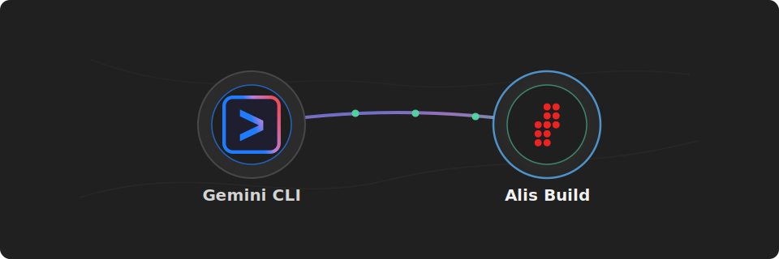

# Alis Build Gemini CLI Extension

<p align="center">
  
</p>

<p align="center">
  <strong>Connect Gemini CLI to Alis Build.</strong>
</p>

Use this extension to let Gemini CLI inspect Alis Build landing zones, products, neurons, builds, deploys, and related workspace context.

## What You Get

- A preconfigured Gemini CLI MCP server for `https://mcp.alis.build`
- A remote Alis Build agent at `https://agent.alis.build`
- OAuth/OIDC sign-in through `https://identity.alisx.com`
- Alis Build context loaded from `GEMINI.md`
- A `BeforeAgent` hook that injects the Alis Build Define-Build-Deploy primer and skill-routing contract when you address Alis (`alis, ...`)
- A `BeforeTool` hook that passes your session context to Alis `LoadSkill` calls for context-aware skills

## Before You Start

You need:

- Gemini CLI installed
- An Alis Build account with access to the landing zones and products you want to use
- Network access to `https://mcp.alis.build`, `https://agent.alis.build`, and `https://identity.alisx.com`

## Install

Install the extension:

```sh
gemini extensions install https://github.com/alis-build/gemini-cli-extension
```

Restart Gemini CLI after installing.

## Sign In

Inside Gemini CLI, run:

```text
/mcp auth alis-build
```

You can also inspect the configured integration:

```text
/extensions list
/mcp
/agents list
```

You should see:

- extension `alis-build`
- MCP server `alis-build` configured for `https://mcp.alis.build`
- agent `alis-build-agent`

The sign-in flow opens `https://identity.alisx.com` in your browser.

## Use It

After sign-in, ask Gemini CLI to use Alis Build:

```text
build it
```

```text
fix it
```

```text
Use Alis Build to list the landing zones I can access.
```

```text
Show recent builds for product os in landing zone alis.
```

```text
@alis-build-agent Review my active Alis Build workspace and suggest the next build or deploy action.
```

## Commands

This extension includes Alis Build workflow shortcuts:

```text
/alis-build:build-it
/alis-build:fix-it
/alis-build:getting-started
```

Type `build it` to discover the right Alis Build skill for the thing you want to build. Type `fix it` to use the same discovery flow when the goal is framed as a fix. `/alis-build:build-it` and `/alis-build:fix-it` are slash-command shortcuts for the same router. `/alis-build:getting-started` uses the Alis Build `getting-started` skill for the platform workflow and simpleapi quickstart. After updating a linked extension, run `/commands reload` or restart Gemini CLI.

## Hooks

This extension bundles hooks (in `hooks/hooks.json`) that run automatically — no setup required:

- **Trigger routing + DBD primer (`BeforeAgent`)** — when you address Alis (`alis, ...`), the Alis Build Define-Build-Deploy primer and the skill-routing contract (build/fix → discover via `SearchSkills` first, don't edit code directly; `spec it` → call `SpecIt` directly) are injected into context. Once injected, follow-up `build it` / `fix it` / `spec it` are handled from that context — they don't re-inject. Other prompts add nothing, in any directory.
- **Skill session context (`BeforeTool`)** — before an Alis `LoadSkill` call runs, your Gemini `session_id` is merged into the request so the Alis Build server can return context-aware skill instructions.

Both hooks require `jq` on your `PATH`. If `jq` is unavailable they exit cleanly and the CLI proceeds unmodified.

## Update

Update the extension:

```sh
gemini extensions update alis-build
```

Restart Gemini CLI after updating.

## Troubleshooting

If the extension does not appear in `/extensions list`, install it again:

```sh
gemini extensions install https://github.com/alis-build/gemini-cli-extension
```

If sign-in fails, confirm that you can reach `https://mcp.alis.build`, `https://agent.alis.build`, and `https://identity.alisx.com`, then run:

```text
/mcp auth alis-build
```
