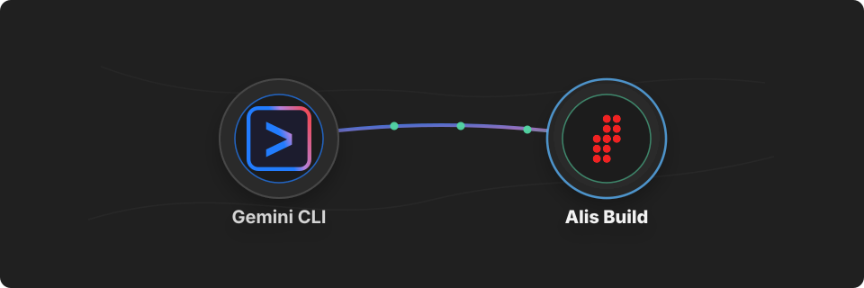

# Alis Build Gemini CLI Extension

<p align="center">
  
</p>

<p align="center">
  <strong>Connect Gemini CLI to Alis Build.</strong>
</p>

Use this extension to let Gemini CLI work with Alis Build organisations, products, neurons, builds, and deploys through the `alis` CLI, with workspace-aware context injected into every session.

## What You Get

- The standing Alis Build Define-Build-Deploy primer (mental model + skill-routing contract + CLI-first execution) always loaded from `GEMINI.md`
- A remote Alis Build agent at `https://agent.alis.build`
- A `SessionStart` hook that injects workspace service context inside Alis Build folders

## Before You Start

You need:

- Gemini CLI installed
- The `alis` CLI installed, on your `PATH`, and signed in (`alis login`)
- An Alis Build account with access to the organisations and products you want to use
- Network access to `https://agent.alis.build` and `https://identity.alisx.com` (for the remote agent)

## Install

Install the extension:

```sh
gemini extensions install https://github.com/alis-build/gemini-cli-extension
```

Restart Gemini CLI after installing.

You can inspect the configured integration:

```text
/extensions list
/agents list
```

You should see:

- extension `alis-build`
- agent `alis-build-agent`

The remote agent's sign-in flow opens `https://identity.alisx.com` in your browser on first use.

## Use It

Ask Gemini CLI to use Alis Build:

```text
build it
```

```text
fix it
```

```text
Use Alis Build to list the organisations I can access.
```

```text
Show recent builds for product os in organisation alis.
```

```text
@alis-build-agent Review my active Alis Build workspace and suggest the next build or deploy action.
```

## Commands

This extension includes Alis Build workflow shortcuts:

```text
/alis-build:build-it
/alis-build:fix-it
/alis-build:getting-started
```

Type `build it` to discover the right Alis Build skill for the thing you want to build. Type `fix it` to use the same discovery flow when the goal is framed as a fix. `/alis-build:build-it` and `/alis-build:fix-it` are slash-command shortcuts for the same router. `/alis-build:getting-started` uses the Alis Build `getting-started` skill for the platform workflow and simpleapi quickstart. After updating a linked extension, run `/commands reload` or restart Gemini CLI.

## Hooks

This extension bundles hooks (in `hooks/hooks.json`) that run automatically — no setup required:

- **Service context (`SessionStart`)** — when a session opens inside an Alis Build service folder (`~/alis.build/<org>/build|define/…`), the package id and a pointer to the matching definitions ⇄ implementation counterpart are injected via `additionalContext`. Silent outside a workspace; requires `jq` — if `jq` is unavailable it exits cleanly and the CLI proceeds unmodified.

The DBD primer and skill-routing contract are not injected by a hook — they live in `GEMINI.md`, which Gemini loads as standing context every session.

## Update

Update the extension:

```sh
gemini extensions update alis-build
```

Restart Gemini CLI after updating.

## Troubleshooting

If the extension does not appear in `/extensions list`, install it again:

```sh
gemini extensions install https://github.com/alis-build/gemini-cli-extension
```

If `alis` commands fail with an auth error, run `alis login` (or `alis authorise <org>.<product>` for git/package credentials) and retry.

If the remote agent's sign-in fails, confirm that you can reach `https://agent.alis.build` and `https://identity.alisx.com`, then retry.
